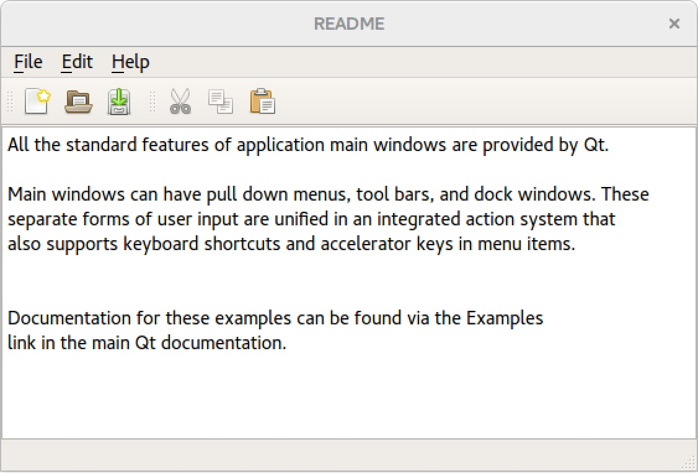

# The Work Principle

## Differences between the basic system and the real OS

#### 1. Stored in external environment
Our system looks like a virtual machine and runs in an external environment. In other words, all our parts are stored in the real memory. The biggest difference between our system and the real system is that most of the instructions in our system need to be operated by external systems. The basic system we formed does not have permission to directly drive the CPU to do the calculation, so we can only take the use of the external system to drive CPU to process related instructions.

For example, to modify the content of a specific byte in analog RAM, the function of our modified instruction has undergone the progress as 

store in analog ROM >> 
read to analog RAM >> 
transfer to external real memory >> 
become an executable C ++ instruction >> 
pass to the CPU for operation and execution >> 
CPU then modifies the specific byte

#### 2. Using analog hardware (RAM, ROM)
However, because our memory is just a simulated 2D array, it can only perform relatively simple operations, and can not perform too complicated operations. Because there is no underlying assembly language to complete the most basic computer instructions, we cannot load the relevant hardware drivers. In addition, because our memory and disk is a completely virtual 2D array, the instructions loaded in analog RAM cannot access the hardware drivers of external systems. 

In order to simulate the process of real system operation, we thought of the following methods to mimic the operation management process of the operating system reading and writing virtual memory.

## Methods of the simulation

#### 1. Using ASCII encoding
In order to find a one-to-one correspondence between the binary 0 and 1 storage format and natural language, we have adopted the internationally accepted ASCII encoding standard. For example, the encoding of the character 'a' is 97, then converted into a binary array is "01100001". We will use this 8-bit binary format array as one byte. Because ASCII has a total of 128 = 2 ^ 7 encodings, then a 7-bit encoding format is sufficient. But in order to follow the operating habits of computer systems, we use an 8-bit storage format. That is, each byte can store a separate character.

Because our operating system is not very complicated, we did not consider reading and writing Chinese characters in the more complicated Unicode encoding. If you use the Unicode-8 encoding format, characters in different formats need 1-4 bytes to complete the one-to-one correspondence, which causes considerable trouble for our RAM index.

#### 2. The storage location of the system is analog ROM
Because the code of this project is also completely composed of standard characters in the ASCII range, we can store the code except the initialization part in the analog ROM. Every time the system is turned on, all instructions in the operating system are stored in the analog ROM in the form of an 8-bit binary array Then instructions are read into the analog RAM, been translated into executable C++ according to the ASCII encoding standard. The C++ code is passed to real memory and then passed to the CPU for execution.

#### 3. Analog BIOS
We can imitate the BIOS part of the real operating system and define the system initialization part as the BIOS of our system. When we simulate the boot process, that is, the process of starting to run our system in the external environment, only a small amount of codes of the basic system will be initialized in the external system. We call this part of the code an analog BIOS. The analog BIOS code is very intuitive and is displayed directly in the external environment.

After the CPU in the external environment reads the analog BIOS, the analog BIOS initializes the analog RAM and the analog ROM, that is, our simulated hardware. This process simulates the process of loading the hardware driver by the BIOS in a real system. 

That is, all the code parts except for the analog BIOS are packaged in  analog ROM, so that the real system's storage structure can be simulated: stored in the hard disk and loaded in memory. Therefore, our analog ROM will leave a sector to store our operating system.

#### 4. Establish a valid path in analog ROM
Each instruction will eventually become, to modify the Byte at a specific location in the virtual RAM.

The difference between our analog RAM and analog ROM is that analog RAM will be restarted every time the program runs, restoring the state where all bits are 0; but the contents of the analog ROM will be saved.

In order to read the contents stored in ROM, we need to establish a valid storage path in analog ROM.

# Basic System 的基本架构
*by Daniel 2020-02-23*

### 一、基本结构
#### 外部系统
* 因为我们这个系统是需要在外部系统上运行的，也就是在需要在 MacOS、Windows、Linux 上运行，所以我们需要解决**系统兼容性**的问题。

* 最后需要把我们的**程序封装**起来，因为C++写出来的程序很多都是在`exe`文件，如果需要在Mac上运行的话，可能会更加麻烦一些。

#### 子环境
*  我们的所有的代码都是储存在这个子环境之中，也就是我们需要些的部分。

*  包括：
    *     RAM 运行内存；
    *     ROM 只读储存器；
    *     指令集 （Fake ROM）

#### RAM
1. 结构：
    * 内存中所有的数据都是 0 或 1，这样的**二元**数据；
    * 是一个 n*4 的 2D 型的内存，每一个 byte 都是一个 4 bits 的**4位储存结构**；
    * 需要**向量化处理**，每一个 byte 都可以用 ${content, index, usage}$ 来表示；
    * 只能**暂时储存**数据，每次打开关闭程序，RAM会重新初始化；
    * $content$ 就是一个 `0 0 0 0 `, `1 0 1 0`, `1 1 1 1`这样的组合；
    * $index$ 就是这个 byte 的索引，似乎只用一维的数据就好了，但是如果考虑到更复杂的情况下，可能会进行维度的提升；
    * $usage$ 就是这个 byte 有没有被使用。

2. Allocation and Release;
    详见天石的proposal。

3. 多进程问题：
    因为考虑到多进程的问题，所以需要考虑到RAM**是否需要分区**的问题，**动态分区**，固定分区，还是其他怎么分区的办法。

4. 内存大小：
    如果需要在RAM中暂存的**数据超过了内存或者内存分区的大小**，需要怎么办？

#### ROM
* 结构与RAM基本相同，区别在于能够**永久储存**数据。

* input 与 output 在 ROM 中的数据怎么才能**传入**到 RAM 中去；在 RAM 中的数据怎么**写入**到 ROM 中来。

* 文件储存的形式，如何生成新的文件，如何储存？

* 是否需要多层次处理，如何处理储存路径的问题。如果新建路径的话，需要怎么储存路径？

#### 指令集（Fake ROM）
* 这部分是需要我们用C++完成的程序指令，我做了一些简单的分类，包括了以下几部分：
    *     模拟BIOS
    *     主程序 (Main system code)
    *     UI (GUI or terminal like)
    *     代码库 (Coding library)
    *     编码规则 (Coding rule)

* 具体的内容见后面

* PS1:因为在真正的系统中，这些东西都是储存在 ROM 中的，但是因为我们的数据储存结构实在是太菜了，而且我们都不会汇编语言，所以就用C++来完成这些代码吧！加油 ~

* PS2:因为我也不是很懂这方面的东西，肯定会有很多疏漏之处，所以希望大家能够一起来丰富这部分的内容！

-------

### 二、指令集结构

#### 模拟BIOS
* 真正的 BIOS 是电源开启后立即启动，会进行硬件自检，然后加载主系统。

* 我们的模拟破产版 BIOS 只需要初始化 RAM 和 ROM，是否需要加载其他的硬件呢？

* 之后加载我们的主系统，加载完主系统后 BIOS 会自动退出。

#### 主系统
* 我们的主系统并没有在我们的 RAM 中运行，而是在外部环境中运行的，不知道这样是否可行。

* 在主系统开始运行后，会自动调用一些 Code Library 中必须加载的东西，比如：
    * GUI 的加载
    * 与 RAM 和 ROM 对接的端口
    * RAM 与 ROM 是否正常的监测程序
    * ...

#### GUI
* 我们是用 GUI 呢，还是用 terminal-like 的界面呢？

* GUI 的情况下，系统需要如何读取，鼠标键盘对窗口、图标、界面的操作？

* terminal 的情况下，我们需要编写什么样的指令？

#### 编码规则
* 可以模仿 utf-8, ASCII 这样的编码模式。因为我们是 2-D,4-bits 的储存系统，有没有适合我们的编码规则？还是需要我们自己进行编码。

* 如何让 OS 在0和1与数字字母两种方式中进行转换？

#### 代码库/Code Implementation
##### 1. Test application
* 需要用来跑的应用，比如说计算器，扫雷，时钟。
* 考虑一下我们的系统只能对 0 和 1 进行操作，所以不能太复杂

##### 2. Input and Output function
* Application 中传入和传出的数据怎么在内存中读取和吸入，指向内存中的哪一个部分。
* 是否需要一个统一的端口来统一控制应用I&O。

##### 3. Multiprocess
* Multiprocess 的集中情况
* one by one
* random
* drill 像转盘一样

##### 4. Reference of mouse and key
* 需要获取外部系统的鼠标位置和硬盘输入。

##### 5. GUI
Solutions    | Advantages | Disadvantages | Decision
------------ | ---------- | ------------- | --------
(1) Command line | Simple!  | Worst visual aid | Just in case...the other two are too difficult :sweat_smile:
(2) User Interface markup language | Plenty of supporting libraries; easy implementation | Not C++ | I'll try it out anyways
(3) C++ Web Development Framework  | Using C++, recommended by prof :+1: | Less supporting resources | Save this for later
(4) Qt GUI widgets  | Using C++, recommended by prof :+1:, comes with Qt Creator |  | Let's do this

##### Proposal
1. Strategy
  * Coding the user interface of simulated operating system using pure C++ code
  * Making use of Qt GUI libraries and widgets
  * Simplicity > Functionality > Appearance at the first stage
2. Sample result

##### 6. Exception
* 程序异常怎么处理？
* 模拟硬件 RAM 中断怎么处理？

##### 7. Security
* 是否需要用户控制？
* 是否需要加密？

##### 8. Storage Path
* 在写入 ROM 里面的数据，是否需要自己的储存路径？
* 如何按照文件夹来储存，如何确定储存地址？

##### 9. ...

#####
